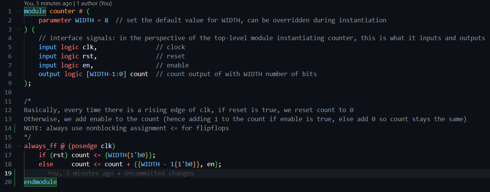
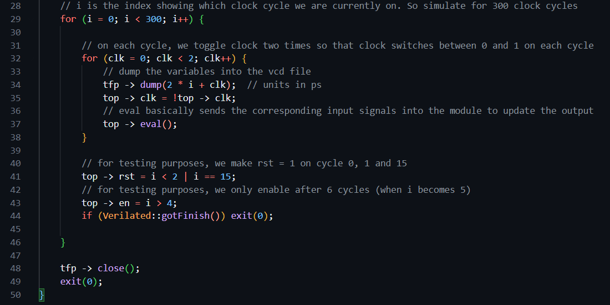
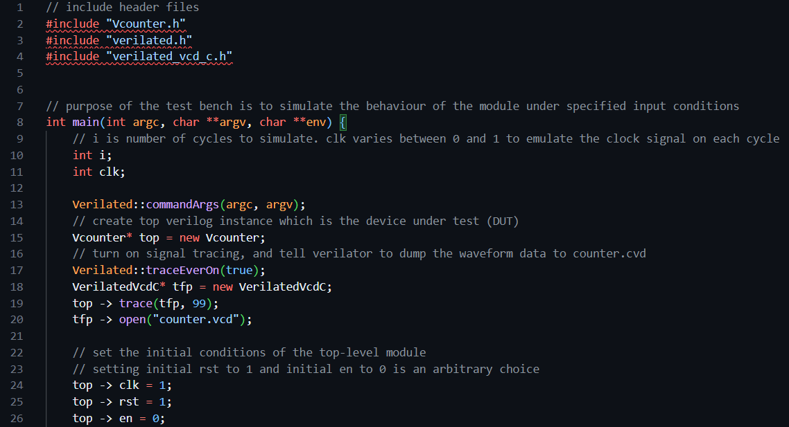
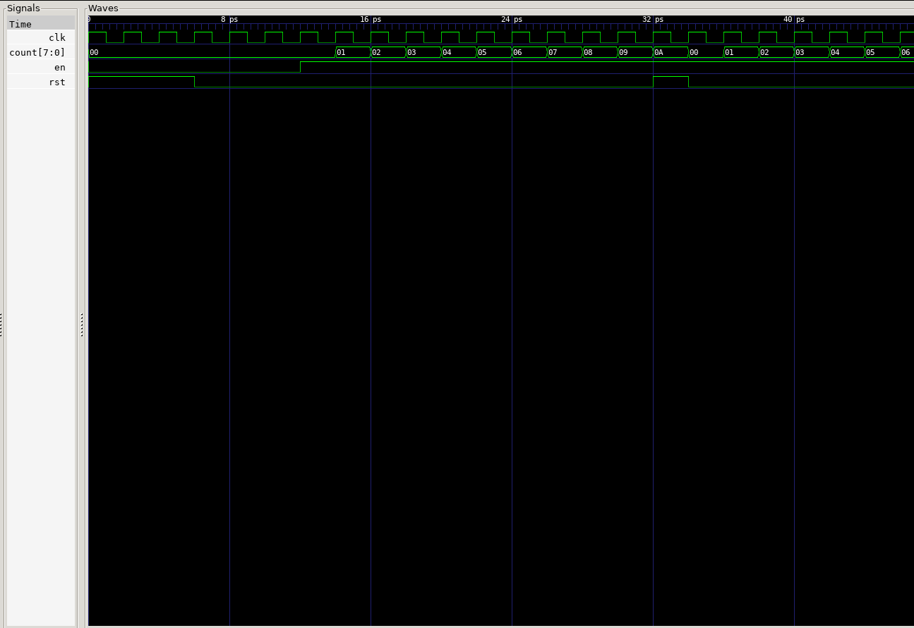
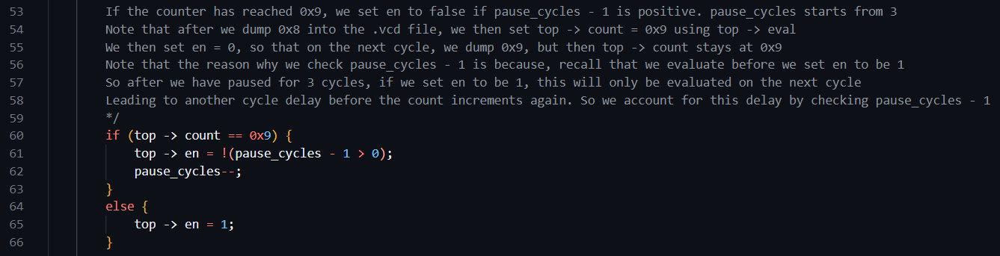
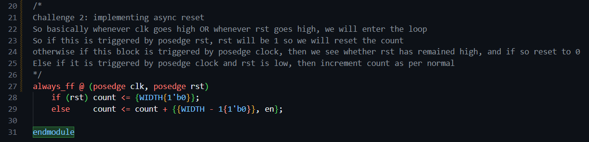
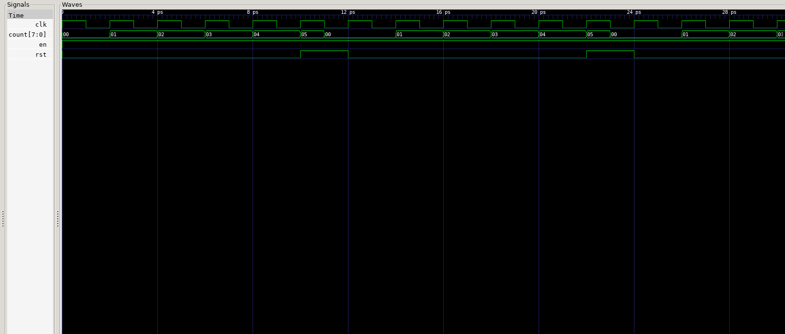

# Task 1

## Counter.sv implementation

We first create the file counter.sv. Basically on a positive clock cycle, if reset is 1, it will set the count to 0. Otherwise, it will add en to the count, so that if en is 1, the count is incremented by 1, else count stays the same since we add 0 to the count.

This is implemented using the following code which emulates the following circuit. The if/else block implements the behaviour of the multiplexer.

## Counter C++ testbench

Next step: create the C++ testbench file. This is because the .sv module on its own will not do anything. We need to use the C++ file to create an instance of the module, and pass in some specified input signals so that we can see how it behaves. See comments in the file for specific details

Next we compile and run to generate the .vcd file, and view it on GTK wave:

## Explanation of the waveform patterns and timings

Note that initially we set top -> clk = 1 hence the clk signal starts at 1. In the C++ testbench, inside the inner for-loop, we dump the signals BEFORE toggling clk, hence 1 is written into the .vcd file before we toggle clk to 0. The first period of clk corresponds to i = 0, then i = 1, 2, etc. Hence, we see that for i = 0 and 1, the test bench sets top -> rst to 1. So on the cycle where i = 2, top -> rst is still 1. It is only AFTER the inner loop where we toggle clk and dump the variables, that we set rst to 0. Hence on the next cycle where i = 3, top -> rst goes to 0.

Similarly, we have top -> en = i > 4. On cycle 4, 4 > 4 is false, hence we still have en = 0. Hence when we begin cycle 5, since we evaluate and dump BEFORE updating en, we still write en = 0 on i = 5. It is only after the inner for-loop, we set top -> en = 1, hence en goes high on cycle 6 and remains high thereafter.

Hence on i = 5, after we dump clk = 0, we set top -> clk = 1 and run eval, however because en is still 0 at this point, counter does not increment. It is only on i = 6, we first dump clk = 1, then set clk = 0 and eval, but this doesn't do anything since it is the falling edge. After we dump clk = 0 (on i = 6), we then set top -> clk = 1 and run top -> eval(), which now will cause counter to increment to 1. Hence, on the next cycle i = 7, we dump counter = 1.

The other thing that happens is on i = 15. At the beginning of the loop on i = 15, rst is still 0 because we only set rst to 1 after dumping the waveforms and evaluating. Hence on i = 15, when we dump clk = 0, then set top -> clk = 1 and eval, the counter still counts up, hence we still see 0A on i = 16. However on i = 15, after dumping the variables, we then set top -> rst = 1, so on i = 16, we dump counter = 0A and rst = 1. Hence, on i = 16 itself, when we set top -> clk = 1 and evaluate, the counter becomes 0, and so we dump 0 on i = 17.

Afterwards on i = 17, rst is 0 again so it continues to count up indefinitely. So the main thing to take note here is, when we dump clk = 1, we then set top -> clk = 0 and run top -> eval. This does not do anything for our module since this is the falling edge of the clock. So it is only when we dump clk = 0, we set top -> clk = 1, and run top -> eval, which updates the counter value. But we only dump on the next clock cycle, so we only see the change on the next cycle.

## Challenge 1

We now want the counter to stop counting for 3 cycles once the counter reaches 0x9, then resume. We first initialise top -> rst = 0 and top -> en = 1 for simplicity so it starts counting up straightaway. We then implement the following logic. See comments for details

This gives the following waveform. Note that because we use pause_cycles - 1, we only set en to 0 for two cycles, not three. But because after en goes to 1, there is a 1 cycle delay before we evaluate the counter to increment again, so overall the counter stays at 0x9 for three cycles, as intended.

## Challenge 2

We now want to implement async reset instead of sync reset. This is implemented as follows. See comments for details:

We test the async reset using the following testbench. See comments for details and explanations:

This gives us the following waveform. As expected, after we reset the count to 0, the count stays at 0 for 1.5 periods of the clk cycle, before going back to 1.

