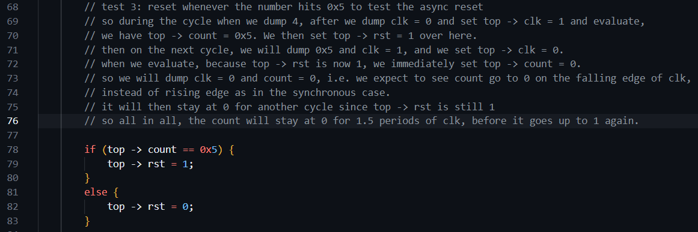
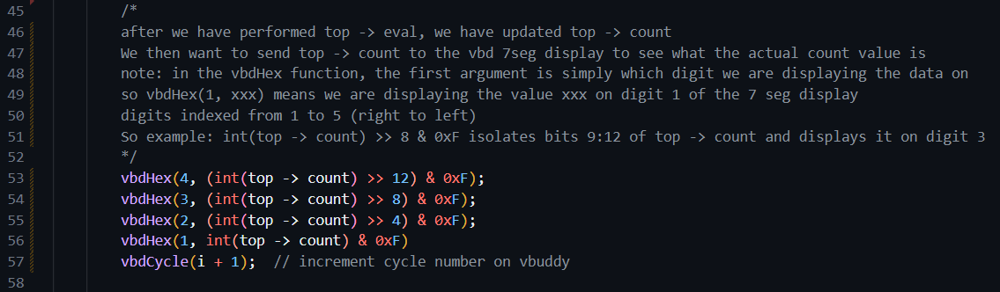

# Task 1

## Counter.sv implementation

We first create the file counter.sv. Basically on a positive clock cycle, if reset is 1, it will set the count to 0. Otherwise, it will add en to the count, so that if en is 1, the count is incremented by 1, else count stays the same since we add 0 to the count.

This is implemented using the following code which emulates the following circuit. The if/else block implements the behaviour of the multiplexer.


## Counter C++ testbench

Next step: create the C++ testbench file. This is because the .sv module on its own will not do anything. We need to use the C++ file to create an instance of the module, and pass in some specified input signals so that we can see how it behaves. See comments in the file for specific details


Next we compile and run to generate the .vcd file, and view it on GTK wave:


## Explanation of the waveform patterns and timings

Note that initially we set top -> clk = 1 hence the clk signal starts at 1. In the C++ testbench, inside the inner for-loop, we dump the signals BEFORE toggling clk, hence 1 is written into the .vcd file before we toggle clk to 0. The first period of clk corresponds to i = 0, then i = 1, 2, etc. Hence, we see that for i = 0 and 1, the test bench sets top -> rst to 1. So on the cycle where i = 2, top -> rst is still 1. It is only AFTER the inner loop where we toggle clk and dump the variables, that we set rst to 0. Hence on the next cycle where i = 3, top -> rst goes to 0.

Similarly, we have top -> en = i > 4. On cycle 4, 4 > 4 is false, hence we still have en = 0. Hence when we begin cycle 5, since we evaluate and dump BEFORE updating en, we still write en = 0 on i = 5. It is only after the inner for-loop, we set top -> en = 1, hence en goes high on cycle 6 and remains high thereafter.

Hence on i = 5, after we dump clk = 0, we set top -> clk = 1 and run eval, however because en is still 0 at this point, counter does not increment. It is only on i = 6, we first dump clk = 1, then set clk = 0 and eval, but this doesn't do anything since it is the falling edge. After we dump clk = 0 (on i = 6), we then set top -> clk = 1 and run top -> eval(), which now will cause counter to increment to 1. Hence, on the next cycle i = 7, we dump counter = 1.

The other thing that happens is on i = 15. At the beginning of the loop on i = 15, rst is still 0 because we only set rst to 1 after dumping the waveforms and evaluating. Hence on i = 15, when we dump clk = 0, then set top -> clk = 1 and eval, the counter still counts up, hence we still see 0A on i = 16. However on i = 15, after dumping the variables, we then set top -> rst = 1, so on i = 16, we dump counter = 0A and rst = 1. Hence, on i = 16 itself, when we set top -> clk = 1 and evaluate, the counter becomes 0, and so we dump 0 on i = 17.

Afterwards on i = 17, rst is 0 again so it continues to count up indefinitely. So the main thing to take note here is, when we dump clk = 1, we then set top -> clk = 0 and run top -> eval. This does not do anything for our module since this is the falling edge of the clock. So it is only when we dump clk = 0, we set top -> clk = 1, and run top -> eval, which updates the counter value. But we only dump on the next clock cycle, so we only see the change on the next cycle.

## Challenge 1

We now want the counter to stop counting for 3 cycles once the counter reaches 0x9, then resume. We first initialise top -> rst = 0 and top -> en = 1 for simplicity so it starts counting up straightaway. We then implement the following logic. See comments for details


This gives the following waveform. Note that because we use pause_cycles - 1, we only set en to 0 for two cycles, not three. But because after en goes to 1, there is a 1 cycle delay before we evaluate the counter to increment again, so overall the counter stays at 0x9 for three cycles, as intended.


## Challenge 2

We now want to implement async reset instead of sync reset. This is implemented as follows. See comments for details:


We test the async reset using the following testbench. See comments for details and explanations:



This gives us the following waveform. As expected, after we reset the count to 0, the count stays at 0 for 1.5 periods of the clk cycle, before going back to 1.


# Task 2

We now want to send the count value to the vbuddy for display on the 7 seg display. We do this by using the following code, where vbdHex sends the value that we want to display, and tells vbuddy to display it on the corresponding digit.



This gives us the output on the vbuddy 7 seg display:


Next, we want to use the rotary encode push switch to control the en signal. We do this by simply including the following code. Basically at the end of each cycle, we simply read the value of vbdFlag which is either 0 or 1. Then we set the en value to be the value of the flag, such that when the flag is 0, we cause it to stop counting.

```
top -> en = vbdFlag();
```

Next we want to plot the values on the screen using the function vbdPlot. See comments for an explanation of how the function works.


This gives us the following output on the vbuddy. Note that the portion in the middle is where the rotary switch was pushed causing the flag, and hence enable, to turn off, causing the counter to stay constant for that period until enable is enabled again.


## Challenge

Similarly, we still want top -> en to be controlled by the value of the vbd flag. However, we want the counter to behave such that it counts up if en = 1, and counts down if en = 0. This is implemented as follows. See comments for details.


This gives the following result when plotted and the vbd flag is varied:


# Task 3

## Part 1

First we change the implementation of counter.sv such that it is loadable. Whenever the control input ld is high, we set counter to the value v passed in. Otherwise we increment counter by 1. Rst still takes precedence, so if rst is 1, we set the count value to 0 regardless of ld.

By default, the vbd flag stores either 0 or 1, and this can be toggled by pressing on the rotary encoder switch. However, we can use vbdSetMode(1) to change it to one-shot behaviour, which means that whenever the rotary encoder switch is pressed, the flag becomes 1 until it is read. Once it is read (using the vbdFlag function), the flag will be reset to a value of 0.

We now want to modify the implementation of the counter such that pressing the switch forces the counter to preset to the vbuddy's vbdValue. We do this by passing in vbdFlag and vbdValue as the input signals ld and v respectively every cycle. So that every cycle, if we happened to press the rotary switch, the ld signal will be set to 1, and so the top -> count will be set to the vbdValue one cycle later. Additionally, after we perform vbdFlag(), it will auto set the vbd flag back to 0, such that on the next cycle onwards the counter will continue incrementing as per normal, until we press the rotary switch again. This is summed up in the following code:


This gives the following result. Note: during the simulation, the rotary switch was rotated and pressed several times, so that the counter was preloaded to the vbdvalue whenever the switch was pressed, before continuing to count upwards.


## Part 2

Next, we want to modify counter.sv such that we increment the counter only when we press the switch, otherwise if we do not press the switch, the count value should stay constant. We do this by modifying counter.sv to only enter the always_ff block whenever we see a rising edge of ld, rather than rising edge of clk. We then interface the counter device with vbuddy by passing in the vbuddy's vbdflag as the ld signal. So that in one shot mode, whenever we press the switch, we send a rising edge of ld to the counter, so the counter increments by 1. After reading the vbdFlag value, the switch goes back to 0 and so ld is 0 and the counter does not enter the block anymore, until we press the switch again. The system verilog implementation, as well as the C++ code used to interface the counter with the vbuddy is shown below:


This gives the following output. The counter increments by 1 only when we press the switch.


# Task 4

For the final task we want to create a top level module that has two subcomponents: the counter module, and a second module which takes in an 8-bit binary number, and converts it into three BCD digits. Example: if the input is 1010 1101, i.e. 0xAD, which has unsigned value 173, the converter will output 0001 0111 0011, which correspondings to digit 1, 7, 3. The main idea is that we want to increment the count as per normal, but instead of just sending the base-16 digits to vbuddy to display on the 7 seg display, we want to first convert it into BCD format, so using the above example, for decimal 173, when we get 0000 1010 1101, instead of displaying 0AD on the 7 segment display, we want to first pass it through the bcd converter so that we display 0001 0111 0011 instead, i.e. 173 on the 7 segment display.

We do this by the following verilog implementation. We use the counter module as per normal, then pass the output of the counter to the input of bin2bcd, then take the bin2bcd output as the overall output. The bin2bcd uses the '>= 5? add 3' algorithm (see lecture 4 slides). Essentially, given the 8 bit hexadecimal input, we just want to left shift the input one bit at a time, shifting the bits into the result. However, at every iteration, before we shift, we first check the digits in the bcd result. If any digit is more than or equal to 5, then after we right shift, it will be at least 10 (not allowed). Hence, before we shift, if the digit is more than or equal to 5, we add 3, so that it is at least 8. Hence, after we left shift, it will be at least 16, hence, we overflow the excess into the next bcd digit. Repeat until we have shifted all 8 bits of the input into the result.


The C++ test bench interface is very simple. The count is just being incremented as per normal, just that the output is bcd rather than hex. But we still send the digits to the 7 seg display the same way, using the vbdHex function.


This gives the following output. For instance, after reaching 009, it counts up to 00A, but instead of displaying 00A, we display 010.


